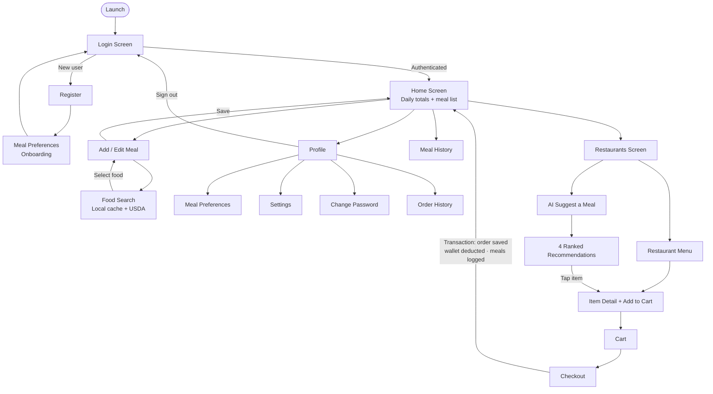
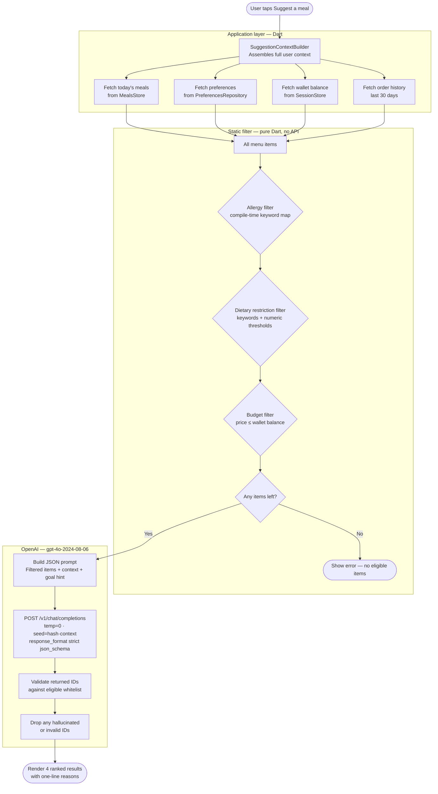
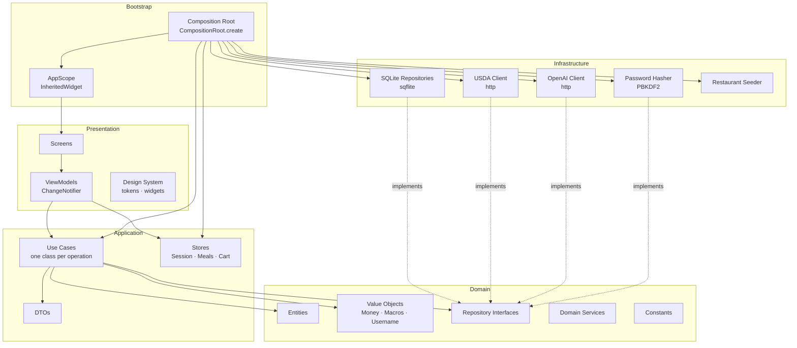

# CalorieTrack

A mobile application that unifies personal nutrition tracking, restaurant food ordering, and AI-powered meal recommendations in a single local-first experience. Built with Flutter as the practical component of a bachelor thesis, the project demonstrates how clean layered architecture, constraint-driven AI integration, and production-quality engineering practices can coexist in a mobile codebase without sacrificing correctness, determinism, or testability.

---

## Table of contents

1. [Motivation](#motivation)
2. [App flow](#app-flow)
3. [Features](#features)
4. [AI recommendation pipeline](#ai-recommendation-pipeline)
5. [Architecture](#architecture)
6. [Design patterns](#design-patterns)
7. [Database schema](#database-schema)
8. [Technical stack](#technical-stack)
9. [Getting started](#getting-started)
10. [Testing](#testing)
11. [Project structure](#project-structure)

---

## Motivation

Most nutrition apps and food ordering apps exist as entirely separate products. A user who orders dinner through a delivery platform still has to manually re-enter everything into their calorie tracker. CalorieTrack collapses this gap: ordering from a restaurant and logging a meal are the same action, completed in a single atomic database transaction.

The second core problem is recommendation quality. Suggesting meals to a user is trivial when no constraints exist, but real users have allergies, dietary preferences, daily calorie budgets, financial constraints, and goals that evolve. The AI layer in this application treats constraints not as guidelines to a language model but as hard filters enforced in Dart before any API call is made — making it structurally impossible to suggest something the user cannot or should not eat, regardless of what the model outputs.

The project is also a practical study in the application of clean architecture to a Flutter codebase, demonstrating that the separation between domain, application, infrastructure, and presentation layers remains meaningful even at a scale typically dismissed as "too small to bother."

---

## App flow



---

## Features

### Meal tracking

- Full CRUD on meals with six macronutrients: calories, protein, carbohydrates, fat, fiber, and sugar.
- Meals are typed (breakfast, lunch, dinner, snack) and carry a date, time, quantity, unit, and optional note.
- The home screen shows a live daily summary with a four-column macro breakdown (protein, carbs, fat, fiber). A history screen covers all past meals with the same item card component.
- When a meal is created from a USDA food result, changing the quantity auto-scales all macronutrient values with a 400 ms debounce.

### USDA food search

- Searches the USDA FoodData Central database (300,000+ items) by name from within the meal creation form.
- Results are divided between the user's local food library and the remote database. Local results appear first.
- A custom `FoodRankingService` scores results by name-match quality and nutritional plausibility to reduce noise.
- Retrieved foods are cached per user in SQLite, making repeat lookups instant and fully offline.

### Restaurant ordering

- 76 seeded restaurants across 23 cuisines, each with realistic menu items, prices, nutrition data, ratings, and estimated delivery times.
- A horizontally scrollable cuisine filter and debounced full-text search narrow the list in real time.
- Each menu is organised by category. Every item shows its price, calorie count, and full macro breakdown before the user adds it.
- The cart is restricted to one restaurant at a time. Switching restaurants requires explicit confirmation.
- Checkout is a single database transaction: the order is persisted, the wallet balance is deducted, and every item is logged as a meal. Failure at any step rolls the entire transaction back.

### Meal preferences

On first login, a guided onboarding screen collects:

| Category | Options |
|---|---|
| Health goal | Lose weight · Gain muscle · Maintain weight · Improve health · Discover new foods |
| Dietary style | Vegetarian · Vegan · Gluten-free · Dairy-free · Keto · Paleo · Halal · Kosher · Low-carb |
| Food allergies | Peanuts · Tree nuts · Dairy · Eggs · Wheat · Shellfish · Fish · Soy · Sesame |
| Daily calorie target | Optional, in kcal |
| Meals per day | 1–6 |

All preferences are stored per user and editable at any time from the profile screen.

### AI meal recommendations

Described in detail in the [AI recommendation pipeline](#ai-recommendation-pipeline) section below.

### Accounts and security

- PBKDF2-HMAC-SHA256 password hashing with a 16-byte per-user random salt and 120,000 iterations.
- Passwords are never stored or logged in plain text at any point in the flow.
- Each account holds a 200 lei simulated wallet used for restaurant orders.
- All data is isolated by `user_id`. `ON DELETE CASCADE` across all child tables ensures clean account removal.

---

## AI recommendation pipeline



### Why constraints are enforced in Dart, not the prompt

A language model can misinterpret or ignore a constraint stated in natural language, especially under edge cases or prompt drift. By filtering ineligible items out of the candidate list before sending anything to the model, the constraint becomes a structural guarantee: the model is presented only with items it is permitted to suggest, so violation is not possible regardless of how the model reasons.

### Determinism

| Parameter | Value | Effect |
|---|---|---|
| `temperature` | `0` | Greedy token selection — no randomness |
| `seed` | hash of request context | Same context → same OpenAI internal state |
| `response_format` | `json_schema` + `strict: true` | Schema-exact JSON, enforced server-side |
| Post-validation | ID whitelist check | Hallucinated IDs removed before display |

The seed is computed as a deterministic hash over the user's health goal, today's calorie consumption, wallet balance, and the sorted list of eligible item IDs. The same user state at the same point in the day always produces the same API request and the same recommendation set.

---

## Architecture



### Layer responsibilities

| Layer | Responsibility | Flutter dependency |
|---|---|---|
| Domain | Entities, value objects, repository interfaces, domain services, constants | None |
| Application | Use cases, DTOs, observable stores, result types | None |
| Infrastructure | SQLite, HTTP clients, password hasher, data seeder | Indirect (sqflite) |
| Presentation | Screens, view-models, design system | Full |
| Bootstrap | Wires concrete dependencies into use cases; exposes them via `AppScope` | Minimal |

---

## Design patterns

| Pattern | Where it appears | Purpose |
|---|---|---|
| **Clean / Onion Architecture** | Entire codebase | Keeps domain logic free of framework and infrastructure concerns |
| **Repository** | `AuthRepository`, `MealRepository`, `PreferencesRepository`, etc. | Abstracts data access behind an interface; infrastructure implements, domain defines |
| **Use Case (Interactor)** | `LoginUser`, `AddMeal`, `PlaceOrder`, `SuggestMeals`, etc. | One class per application operation; single responsibility, independently testable |
| **DTO** | `MealDto`, `MenuItemDto`, `MealPreferencesDto`, `MealSuggestionDto` | Prevents domain types leaking into the presentation layer |
| **Value Object** | `Money`, `Macros`, `Username`, `Password` | Encapsulates validation and domain rules; immutable, equality by value |
| **Observer** | `ObservableValue<T>`, `ChangeNotifier` | Reactive state propagation from stores to view-models to screens |
| **Unit of Work** | `SqfliteUnitOfWork` | Batches multiple repository operations into a single atomic transaction |
| **MVVM** | Presentation layer — every screen has a paired ViewModel | Separates UI state management from widget rendering |
| **Composition Root** | `CompositionRoot.create()` | Single place that constructs and wires all dependencies; nothing else does `new ConcreteRepository()` |
| **Strategy** | `FoodRankingService`, `NutritionPlausibility`, `RestaurantSearchService` | Swappable algorithms injected via constructor |
| **Facade** | `CartService` | Presents a simplified interface over the `Cart` domain aggregate and its observable state |

---

## Database schema

```mermaid
erDiagram
    users {
        int id PK
        text username UK
        text password_hash
        text salt
        int created_at
        real balance
    }
    meals {
        int id PK
        int user_id FK
        text meal_name
        text meal_type
        real quantity
        text unit
        real calories
        real protein
        real carbs
        real fat
        real fiber
        real sugar
        int date
        text notes
    }
    foods {
        int id PK
        int user_id FK
        int fdc_id
        text food_name
        real calories
        real protein
        real carbs
        real fat
        real fiber
        real sugar
        real serving_size
        text serving_unit
        int created_at
    }
    meal_preferences {
        int id PK
        int user_id UK_FK
        text dietary_restrictions
        text allergies
        text health_goal
        int daily_calorie_target
        int meals_per_day
    }
    user_settings {
        int id PK
        int user_id UK_FK
        text default_unit
    }
    restaurants {
        int id PK
        text name
        text cuisine
        real delivery_fee
        real rating
        int estimated_minutes
        int created_at
    }
    menu_items {
        int id PK
        int restaurant_id FK
        text name
        text description
        text category
        real price
        real calories
        real protein
        real carbs
        real fat
        real fiber
        real sugar
    }
    orders {
        int id PK
        int user_id FK
        int restaurant_id
        text restaurant_name
        real subtotal
        real delivery_fee
        real total
        int created_at
    }
    order_items {
        int id PK
        int order_id FK
        int menu_item_id
        text name
        text description
        real price
        real quantity
        real calories
        real protein
        real carbs
        real fat
        real fiber
        real sugar
    }

    users ||--o{ meals : "logs"
    users ||--o{ foods : "caches"
    users ||--|| meal_preferences : "has"
    users ||--|| user_settings : "has"
    users ||--o{ orders : "places"
    restaurants ||--o{ menu_items : "offers"
    orders ||--o{ order_items : "contains"
```

All tables are keyed by `user_id`. `PRAGMA foreign_keys = ON` is set on every connection, and all child tables use `ON DELETE CASCADE` so removing a user removes all associated data in one statement.

---

## Technical stack

| Concern | Choice | Notes |
|---|---|---|
| Framework | Flutter 3.x (Dart 3.x) | Cross-platform; Android and iOS from one codebase |
| Local persistence | SQLite via `sqflite` | Schema version 10; manual migrations with `IF NOT EXISTS` and `ALTER TABLE ADD COLUMN` backfills |
| HTTP | `http` package | Used for both USDA and OpenAI clients; no third-party REST library |
| Password hashing | PBKDF2-HMAC-SHA256 | 120,000 iterations, 16-byte salt per user, `crypto` package |
| Environment config | `flutter_dotenv` | API keys read from `.env`; never committed |
| AI model | `gpt-4o-2024-08-06` | First GPT-4o version with structured output support (`json_schema` + `strict: true`) |
| State management | `ChangeNotifier` + `ObservableValue<T>` | No external library; hand-rolled reactive primitive |
| DI / composition | Manual composition root | No `get_it` or `provider`; dependencies are explicit and traceable |
| Architecture | Clean Architecture (Onion) | Four layers; domain has zero Flutter imports |
| Testing | `flutter_test` + tagged E2E suite | Mock OpenAI server for offline tests; real API tests gated on env key |

---

## Getting started

### Prerequisites

- Flutter SDK 3.x (`flutter --version` to verify)
- Android SDK with an emulator, or Xcode with a simulator

### Install dependencies

```bash
flutter pub get
```

### Configure environment

Create a `.env` file in the project root. It is declared as a Flutter asset and must exist even if both keys are left empty:

```env
USDA_API_KEY=DEMO_KEY
OPENAI_API_KEY=sk-...
```

`DEMO_KEY` is a real USDA key with a conservative rate limit — sufficient for development and testing. The OpenAI key is only required for the AI recommendation feature; the entire rest of the app works without it.

### Run

```bash
flutter run
```

On first launch the SQLite database is created at schema version 10 and 76 restaurants are seeded in a single transaction. Subsequent launches skip seeding if the restaurants table is non-empty.

### Static analysis

```bash
flutter analyze
```

The project is configured with `flutter_lints`. The target is zero issues at all times.

---

## Testing

```bash
# All unit and widget tests
flutter test

# End-to-end AI recommendation tests (requires OPENAI_API_KEY)
flutter test --tags e2e
```

### Test coverage areas

| Category | Scope | API required |
|---|---|---|
| **A — Static filters** | Allergy, dietary restriction, and budget filters with known inputs | No |
| **B — Determinism** | Same `SuggestionRequest` produces identical results; seed changes when context changes | No (mock server) |
| **C — Constraint satisfaction** | Returned items always belong to the pre-filtered whitelist; allergy and dietary rules verified on real responses | Yes |
| **D — Goal alignment** | `gainMuscle` biases toward high-protein items; `loseWeight` biases toward lower-calorie options; `exploreNew` surfaces unfamiliar cuisines | Yes |
| **E — Integration** | Full use-case flow: context assembly → filter → call → validate → DTO | No (mock server) |
| **F — UI** | Suggestion sheet renders loading, results, and error states correctly | No |

The mock OpenAI server (`test/helpers/mock_openai_server.dart`) starts a local HTTP endpoint that validates the request shape (temperature, seed, schema format) and returns a stable fixture. This allows the full pipeline to be tested in CI without credentials.

---

## Project structure

```
lib/
├── main.dart
├── bootstrap/
│   └── composition_root.dart       single wiring point for all dependencies
├── config/
│   ├── app_config.dart             AppConfig interface (USDA key, OpenAI key, base URLs)
│   └── env_app_config.dart         dotenv-backed implementation
├── domain/
│   ├── auth/                       User entity, Username/Password value objects, AuthRepository
│   ├── meals/                      Meal entity, MealType
│   ├── foods/                      Food entity, FoodRankingService, NutritionPlausibility
│   ├── restaurants/                Restaurant, MenuItem, RestaurantSearchService
│   ├── ordering/                   Cart, CartLine
│   ├── preferences/                MealPreferences, DietaryRestriction, FoodAllergy, HealthGoal
│   ├── settings/                   UserSettings, FoodUnit
│   ├── suggestions/                MealSuggestion, SuggestionRequest, MealSuggestionRepository
│   ├── shared/                     Money, Macros, failures, result types, password hasher interface
│   └── constants/                  WalletConstants, MealConstants, PreferencesConstants,
│                                   SuggestionConstants, OpenAiConstants, RestrictionConstants
├── application/
│   ├── auth/                       LoginUser, RegisterUser, LogoutUser, ChangePassword,
│   │                               SessionStore, UserDto
│   ├── meals/                      AddMeal, UpdateMeal, DeleteMeal, GetMeal, LoadMeals,
│   │                               MealsStore, MealDto
│   ├── foods/                      SearchFoods, FoodDto
│   ├── restaurants/                DiscoverRestaurants, GetRestaurantMenu,
│   │                               RestaurantDto, MenuItemDto
│   ├── ordering/                   PlaceOrder, ListOrders, CartService, CartDto
│   ├── preferences/                GetMealPreferences, SaveMealPreferences, MealPreferencesDto
│   ├── settings/                   GetUserSettings, SaveUserSettings, UserSettingsDto
│   ├── suggestions/                SuggestMeals, SuggestionContextBuilder, MealSuggestionDto
│   └── shared/                     MacrosDto, OperationResult, ObservableValue
├── infrastructure/
│   ├── persistence/                AppDatabase, SqfliteUnitOfWork, tables.dart
│   ├── repositories/               SqfliteAuthRepository, SqfliteMealRepository,
│   │                               SqfliteFoodRepository, SqfliteRestaurantRepository,
│   │                               SqfliteOrderRepository, SqflitePreferencesRepository,
│   │                               SqfliteSettingsRepository, OpenAiMealSuggestionRepository
│   ├── filtering/                  AllergyFilter, DietaryRestrictionFilter, BudgetFilter
│   ├── remote/                     UsdaClient, OpenAiClient
│   ├── security/                   Pbkdf2PasswordHasher
│   └── seed/                       RestaurantSeeder, seed_data.dart
└── presentation/
    ├── design/                     AppColors, AppTypography, AppSpacing, AppRadii,
    │                               AppButton, AppCard, AppTextField, AppScaffold, AppTheme
    ├── common/                     AppScope, AppDependencies, ViewModel base, formatters
    ├── auth/                       LoginScreen, RegisterScreen + ViewModels
    ├── meals/                      HomeScreen, CreateMealScreen, UpdateMealScreen,
    │                               MealDetailsScreen, MealHistoryScreen, MealItem + ViewModels
    ├── foods/                      FoodSearchScreen + ViewModel
    ├── restaurants/                DiscoverScreen, RestaurantMenuScreen + ViewModels
    ├── ordering/                   CheckoutScreen, OrderHistoryScreen,
    │                               CartCompleteBar, MenuItemPopup + ViewModels
    ├── preferences/                PreferencesScreen + ViewModel + widgets
    ├── settings/                   SettingsScreen + ViewModel
    ├── suggestions/                SuggestionSheet + ViewModel
    └── profile/                    ProfileScreen, ChangePasswordScreen + ViewModels

test/
├── unit/                           AllergyFilter, DietaryRestrictionFilter, BudgetFilter,
│                                   SuggestionContextBuilder tests
├── helpers/
│   └── mock_openai_server.dart     local HTTP mock for the OpenAI endpoint
└── e2e/
    └── meal_suggestion_e2e_test.dart
```
